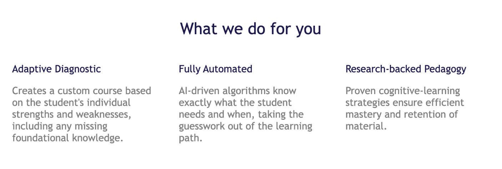

Подготовка к экзамену (при этом инструментарий L7 идет параллельно и встраивается в подготовку):

Учебник (с Аудио - мульти language)

Словарь - Карточки - ключевые концепты

Общий словарь - формируем сами (например читая учебник или работая с вопросами) или загружаем все сразу из готового списка.

Тесты по разделам по аналогии с prepagent - также рассказываем про то что под капотом Adaptive Diagnostic + Research-backed Pedagogy + Fully Automated (как на https://www.mathacademy.com/ - изучи этот сайт)

Webinars - нам не надо
Private Tutoring -  - нам не надо

Math Course - рассказать что математике мы научим любого - сильные вещи можно взять с https://www.mathacademy.com/ - изучи их продукт

Tips (Path) - тут мы рассказываем как пользоваться сервисом, возможно Graph сделаем, как на https://www.mathacademy.com/ 
